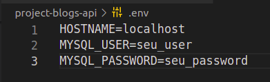

<h1>💻 Blogs Api 📨</h1>

<h2>Índice</h2>
<h4>- <a href="#context">Contexto</a></h4>
<h4>- <a href="#tecnologies">Técnologias utilizadas</a></h4>
<h4>- <a href="#development">Desenvolvimento</a></h4>
<h4>- <a href="#howtouse">Como executar o projeto</a></h4>

<h2 id="context">Contexto</h2>

O Blogs API é um projeto de back-end, onde foi feito uma API CRUD para um Blog.

Esse projeto foi desenvolvido durante o curso da Trybe com o objetivo de consolidar os estudos de sequelize e a construção de uma API CRUD com ORM utilizando NodeJS, foi realizado em Maio de 2022, no módulo de Back-end.

<h2 id="tecnologies">Técnologias utilizadas</h2>

<ul>
  <li>NodeJS</li>
  <li>Sequelize</li>
</ul>

<h2 id="development">Desenvolvimento</h2>

Neste projeto pude implementar as tabelas do banco de dados utilizando MySQL, com o Sequelize para auxiliar.

Após isso pude criar uma API CRUD com ORM.

<h2 id="howtouse">Como executar o projeto</h2>

  1. Clone o repositório:
     
    * `git clone git@github.com:gustavo-pd/project-blogs-api.git`.
     
    Entre na pasta do repositório que você acabou de clonar:
     
      * `cd project-blogs-api`
 

  2. Instale as dependências:
   
    * `npm install`
   

  3. Configure as variáveis de ambiente:
   
    * Crie o arquivo .env na raiz do projeto e crie as variáveis de ambiente utilizando seu user e password do Mysql.

 

  4. Utilize os seguintes comandos para iniciar o banco de dados, criar as tabelas e populá-las:
     
    * `npm run prestart`
     
    * `npm run seed`
 

  5. Inicie a aplicação, ela rodará na porta 3000:
     
    * `npm run start`
     
    * `http://localhost:3000`
 
